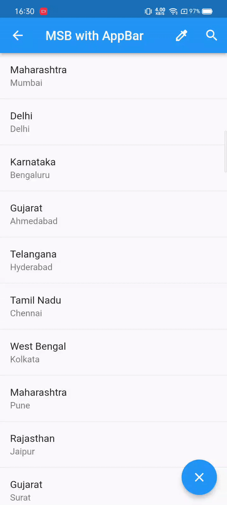

## Material Search Bar

Material search bar with circular reveal animation like whatsapp as flutter widget.
Inspired by WhatsApp SearchView and Android [MaterialSearchView](https://github.com/leoncydsilva/MaterialSearchView)

## Features

<div align:left;display:inline;>

</div>

## Usage

```dart
import 'package:flutter_material_search_bar/flutter_material_search_bar.dart';

MaterialSearchBar(
  // @required
  controller: MaterialSearchBarController(),
  // @required
  appBar: AppBar(
    title: const Text('AppBar'),
  ),
  // @required
  textField: TextField(),
  //to show the back button and customized as per need
  backButton: IconButton(
    icon: Icon(Icons.arrow_back),
  ),
  //to show the clear button and customized as per need
  clearButton: IconButton(
    icon: Icon(Icons.close),
  ),
),
```

## Pending Task
1. To provide Offset support
2. Animation curve support

## Contribution
1. Fork it
2. Create your feature branch (git checkout -b my-new-feature)
3. Commit your changes (git commit -m 'Add some feature')
4. Push to the branch (git push origin my-new-feature)
5. Create new Pull Request

## Support the Library

- You can support the library by staring it on Github && liking it on pub or report any bugs you encounter.
- also, if you have a suggestion or think something can be implemented in a better way, open an issue and let's talk about it.
